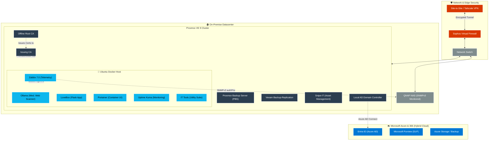

# 🏠 Homelab

My personal homelab environment — a space for continuous learning and hands-on experimentation with infrastructure, virtualization, backup, security, hybrid cloud, and automation.

> ⚠️ All configurations, IP addresses, domain names, and credentials shared in this repo are sanitized/example values. No real environment details are exposed.

---

## 📌 Purpose

This repo documents the technologies I use in enterprise environments as an IT professional, applied and tested in my own homelab — including the tools I've learned, the problems I've run into, and how I solved them.

---

## 🖥️ Infrastructure Overview

| Component | Tool Used | Purpose |
|---|---|---|
| Virtualization Node | Proxmox VE 9 | Core hypervisor for all VMs and LXC containers |
| Container Cluster | Red Hat OpenShift Local | Testing container-native virtualization and taints |
| Domain Controller | Windows Server AD DS | Local Domain Controller (DC) for on-premise identity |
| Certificate Authority | Windows Server AD CS | Two-tier Internal PKI (Root CA & Issuing CA) for secure communications |
| Storage / NAS | QNAP | Centralized storage, RAID, and secure SNMPv3 monitoring |
| Monitoring & Telemetry| Zabbix 7.0 | Centralized infrastructure polling (SNMPv3 & Agent 2) |
| Backup (Proxmox) | Proxmox Backup Server (PBS) | Proxmox-based backup |
| Container Platform | Docker | Service/application isolation |

### ☁️ Microsoft 365 / Azure & On-Prem Microsoft

| Component | Tool Used | Purpose |
|---|---|---|
| Identity Management | Entra ID (Azure AD) | Cloud identity synced with the Local Active Directory |

| Compliance & Data Governance | Microsoft Purview | Data Loss Prevention (DLP) and sensitivity labels |
| Storage | Azure Storage | Cloud storage solutions |

---

## 🗺️ Architecture & Network Topology

---

## 🐳 Docker Services

Services I run via Docker Compose in isolated environments:

*   **Snipe-IT:** Enterprise IT Asset Management (linked with MariaDB and isolated via bridge networks).
*   **Ollama:** Local AI/LLM workloads, featuring a custom automated web scanning task scheduled to run every Wednesday.
*   **LoveBox:** Custom containerized Python Flask application for automated email notifications.
*   **Zabbix Agent 2:** Container telemetry and health monitoring.

---

## 🛠️ Issues Encountered & Solutions

This section documents technical issues I've run into during the homelab journey and how I resolved them.

### Proxmox VE Major Upgrade Boot Failure
**Problem:** Upgrading the hypervisor node from Proxmox VE 8.4 to version 9 resulted in UEFI boot errors.
**Solution:** Executed full pre-upgrade compliance checks and manually adjusted the boot parameters via shell to restore regular system operations.

### Snipe-IT Docker 500 Server Error
**Problem:** Post-deployment of Snipe-IT via Docker Compose returned a persistent 500 Server Error due to missing encryption keys.
**Solution:** Executed `php artisan key:generate` to create a base64 application key, injected it into the `.env` (docker-compose) configuration, and forcefully cleared the Laravel cache (`artisan config:clear`).

### QNAP Hardware Encryption Limitations for SNMP
**Problem:** Older QNAP hardware only supported deprecated DES encryption for SNMPv3, causing monitoring integration issues.
**Solution:** Configured Zabbix to utilize `authPriv` with SHA authentication and CBC-DES privacy protocol. This ensured data was encrypted during polling despite hardware limitations, avoiding plaintext transmission.

---

## 📚 Learnings / Notes

- Successfully deployed a container-native IT Asset Management architecture that eliminates "Dependency Hell" for PHP environments.
- Mastered secure device monitoring via Zabbix using Active Polling rather than passive Trapping.

- Established a robust Two-Tier PKI infrastructure (Root CA & Issuing CA) for secure internal network communications and certificate lifecycle management.

---

## 🔗 Contact

- **Name:** İsmail Bostan
- **LinkedIn:** [İsmail Bostan](https://www.linkedin.com/in/ismail-bostan-88a85844/)
- **E-mail:** [ismailbostann@gmail.com](mailto:ismailbostann@gmail.com)
